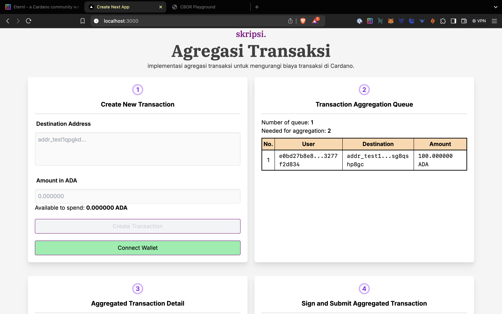

# skripsi

Kode implementasi untuk Skripsi Agregasi Transaksi



## Pre-requisites

1. NodeJS
2. Eternl wallet

## Setup

1. In each directories `backend-nestjs` and `frontend-nextjs` run `npm install`
2. In `backend-nestjs`, create `env/.dev.env` following the sample inside `env/.env.sample`. Fill the Blockfrost API ([create here](https://blockfrost.io/)) and Redis URL ([create here](https://app.redislabs.com/))
3. Start the backend service

    ```bash
    npm run start:dev
    ```

4. Start the frontend service

    ```bash
    npm run dev
    ```

5. Open `localhost:3000` on your browser that has Eternl wallet installed
